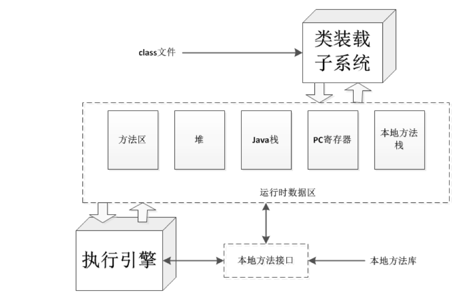
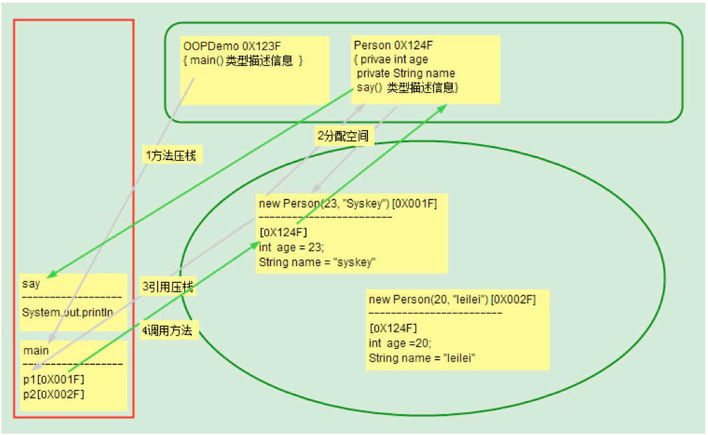
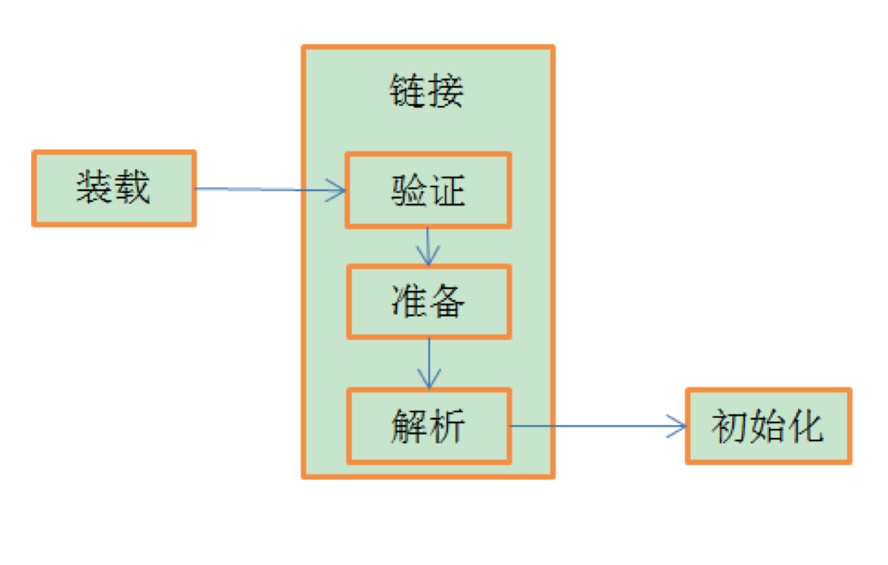
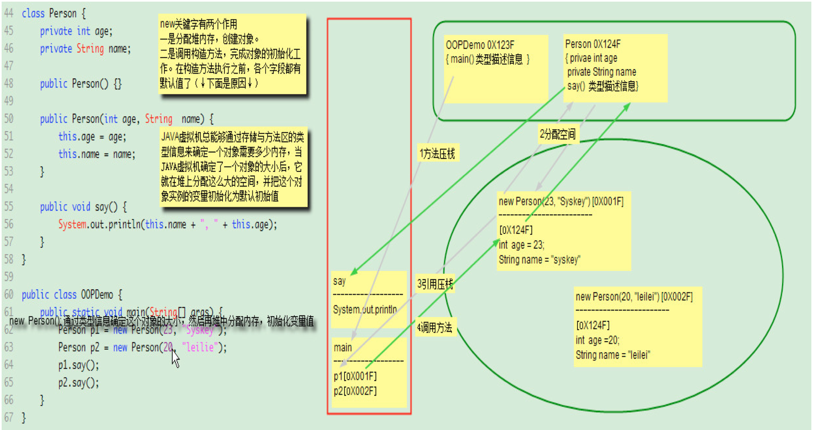
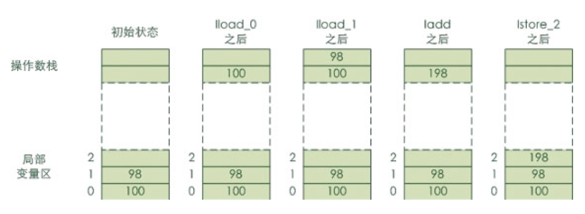
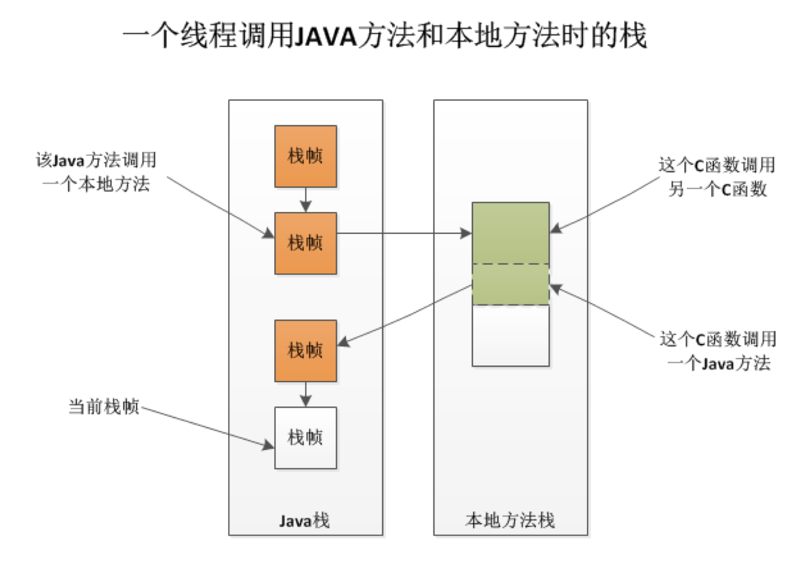
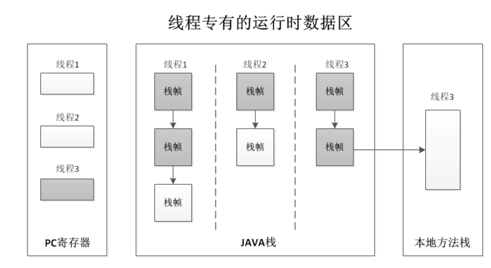

JAVA虚拟机的生命周期

　　一个运行时的Java虚拟机实例的天职是：负责运行一个java程序。当启动一个Java程序时，一个虚拟机实例也就诞生了。当该程序关闭退出，这个虚拟机实例也就随之消亡。如果同一台计算机上同时运行三个Java程序，将得到三个Java虚拟机实例。每个Java程序都运行于它自己的Java虚拟机实例中。

1.入口：
Java虚拟机实例通过调用某个初始类的main()方法来运行一个Java程序。而这个main()方法必须是共有的(public)、静态的(static)、返回值为void，并且接受一个字符串数组作为参数。任何拥有这样一个main()方法的类都可以作为Java程序运行的起点。

public class Test {

    public static void main(String[] args) {
        // TODO Auto-generated method stub
        System.out.println("Hello World");
    }

}　　在上面的例子中，Java程序初始类中的main()方法，将作为该程序初始线程的起点，任何其他的线程都是由这个初始线程启动的。

2.JVM内部线程：
在Java虚拟机内部有两种线程：守护线程和非守护线程。守护线程通常是由虚拟机自己使用的，比如执行垃圾收集任务的线程。但是，Java程序也可以把它创建的任何线程标记为守护线程。而Java程序中的初始线程——就是开始于main()的那个，是非守护线程。

　　只要还有任何非守护线程在运行，那么这个Java程序也在继续运行。当该程序中所有的非守护线程都终止时，虚拟机实例将自动退出。假若安全管理器允许，程序本身也能够通过调用Runtime类或者System类的exit()方法来退出。
　　
　　
　　
JAVA虚拟机体系结构 

图1是JAVA虚拟机的结构图，每个Java虚拟机都有一个类装载子系统，它根据给定的全限定名来装入类型（类或接口）。同样，每个Java虚拟机都有一个执行引擎，它负责执行那些包含在被装载类的方法中的指令。
　　

    当我们使用命令来执行某一个Java程序(比如Test.class)的时候：java Test
      (1) java.exe 会帮助我们找到 JRE ，接着找到位于 JRE 内部的 jvm.dll ，这才是真正的 Java 虚拟机器 , 最后加载动态库，激活 Java 虚拟机器。
      (2) 虚拟机器激活以后，会先做一些初始化的动作，比如说读取系统参数等。一旦初始化动作完成之后，就会产生第一个类装载器―― Bootstrap Loader(启动类装载器 ) 。
      (3) Bootstrap Loader 所做的初始工作中，除了一些基本的初始化动作之外，最重要的就是加载 Launcher.java 之中的 ExtClassLoader(扩展类装载器)，并设定其 Parent 为 null ，代表其父加载器为 BootstrapLoader 。
      (4) 然后 Bootstrap Loader 再要求加载 Launcher.java 之中的 AppClassLoader(用户自定义类装载器) ，并设定其 Parent 为之前产生的ExtClassLoader 实体。这两个加载器都是以静态类的形式存在的。

1.类装载子系统
　　
在JAVA虚拟机中，负责查找并装载类的那部分被称为类装载子系统。
　　
JAVA虚拟机有两种类装载器：启动类装载器和用户自定义类装载器。
　　
前者是JAVA虚拟机实现的一部分，后者则是Java程序的一部分。由不同的类装载器装载的类将被放在虚拟机内部的不同命名空间中。
　　
类装载器子系统涉及Java虚拟机的其他几个组成部分，以及几个来自java.lang库的类。比如，用户自定义的类装载器是普通的Java对象，它的类必须派生自java.lang.ClassLoader类。ClassLoader中定义的方法为程序提供了访问类装载器机制的接口。此外，对于每一个被装载的类型，JAVA虚拟机都会为它创建一个java.lang.Class类的实例来代表该类型。和所有其他对象一样，用户自定义的类装载器以及Class类的实例都放在内存中的堆区，而装载的类型信息则都位于方法区。见图2：（图中的堆中保存的地址就是java.lang.Class类的实例的引用（地址），而方法区存有对应的.Class类的实例，（其实这个实例就是保存了类的信息），除非方法区中对应的类信息被卸载，不然这个对象不会被GC回收）

   类装载器子系统 除了要定位和导入二进制class文件外，还必须负责验证被导入类的正确性，为类变量分配并初始化内存，以及帮助解析符号引用。这些动作必须严格按以下顺序进行：
　　（1）装载——查找并装载类型的二进制数据。
　　（2）连接——指向验证、准备、以及解析（可选）。
　　　　●　验证　　确保被导入类型的正确性。
　　　　●　准备　　为类变量分配内存，并将其初始化为默认值。
　　　　●　解析　　把类型中的符号引用转换为直接引用。
　　初始化——把类变量初始化为正确初始值。

　　
　　
　　
　　那为什么我要有验证 这一步骤呢？首先如果由编译器生成的class文件，它肯定是符合JVM字节码格式的，但是万一有高手自己写一个class文件，让JVM加载并运行，用于恶意用途，就不妙了，因此这个class文件要先过验证这一关，不符合的话不会让它继续执行的，也是为了安全考虑吧。
　　
验证 主要经历几个步骤：文件格式验证->元数据验证->字节码验证->符号引用验证
　　文件格式验证：验证字节流是否符合Class文件格式的规范并 验证其版本是否能被当前的jvm版本所处理。ok没问题后，字节流就可以进入内存的方法区进行保存了。后面的3个校验都是在方法区进行的。
  元数据验证：对字节码描述的信息进行语义化分析，保证其描述的内容符合java语言的语法规范。
  字节码检验：最复杂，对方法体的内容进行检验，保证其在运行时不会作出什么出格的事来。
  符号引用验证：来验证一些引用的真实性与可行性，比如代码里面引了其他类，这里就要去检测一下那些来究竟是否存在;或者说代码中访问了其他类的一些属性，这里就对那些属性的可以访问行进行了检验。(这一步将为后面的解析工作打下基础)
　　
　　
　　准备阶段：常量池此时已被存放在方法区内存中，会为类变量(指那些静态变量)分配内存并设置类比那辆初始值的阶段，这些内存在方法区中进行分配。这里要说明一下，这一步只会给那些静态变量设置一个初始的值，而那些实例变量是在实例化对象时进行分配的。这里的给类变量设初始值跟类变量的赋值有点不同，比如下面：
　　
　　　　public static int value=123;
　　
　　　　在这一阶段，value的值将会是0，而不是123，因为这个时候还没开始执行任何java代码，123还是不可见的，而我们所看到的把123赋值给value的putstatic指令是程序被编译后存在于()，所以，给value赋值为123是在初始化的时候才会执行的。
　　
　　　　这里也有个例外：
　　
　　　　public static final int value=123;
　　
　　　　这里在准备阶段value的值就会初始化为123了。这个是说，在编译期，javac会为这个特殊的value生成一个ConstantValue属性，并在准备阶段jm就会根据这个ConstantValue的值来为value赋值了。
　　
解析 把类型中的符号引用转换为直接引用 (实现常量池地址解析等)。
　　
类什么时候才被初始化：
1）创建类的实例，也就是new一个对象
2）访问某个类或接口的静态变量，或者对该静态变量赋值
3）调用类的静态方法
4）反射（Class.forName("com.lyj.load")）
5）初始化一个类的子类（会首先初始化子类的父类）
6）JVM启动时标明的启动类，即文件名和类名相同的那个类
只有这6中情况才会导致类的类的初始化。

类的初始化步骤：
1）如果这个类还没有被加载和链接，那先进行加载和链接
2）假如这个类存在直接父类，并且这个类还没有被初始化（注意：在一个类加载器中，类只能初始化一次），那就初始化直接的父类（不适用于接口）
3)加入类中存在初始化语句（如static变量和static块），那就依次执行这些初始化语句。

2.方法区
　　在Java虚拟机中，关于被装载类型的信息存储在一个逻辑上被称为方法区的内存中。当虚拟机装载某个类型时，它使用类装载器定位相应的class文件，然后读入这个class文件——1个线性二进制数据流，然后它传输到虚拟机中，紧接着虚拟机提取其中的类型信息，并将这些信息存储到方法区。该类型中的类（静态）变量同样也是存储在方法区中。
　　JAVA虚拟机在内部如何存储类型信息，这是由具体实现的设计者来决定的。
　　当虚拟机运行Java程序时，它会查找使用存储在方法区中的类型信息。由于所有线程都共享方法区，因此它们对方法区数据的访问必须被设计为是线程安全的。比如，假设同时有两个线程都企图访问一个名为Lava的类，而这个类还没有被装入虚拟机，那么，这时只应该有一个线程去装载它，而另一个线程则只能等待。
　　对于每个装载的类型，虚拟机都会在方法区中存储以下类型信息：
　　●　这个类型的全限定名
　　●　这个类型的直接超类的全限定名（除非这个类型是java.lang.Object，它没有超类）
　　●　这个类型是类类型还是接口类型
　　●　这个类型的访问修饰符（public、abstract或final的某个子集）
　　●　任何直接超接口的全限定名的有序列表
　　除了上面列出的基本类型信息外，虚拟机还得为每个被装载的类型存储以下信息：
　　●　该类型的常量池
　　●　字段信息
　　●　方法信息
　　●　除了常量以外的所有类（静态）变量
　　●　一个到类ClassLoader的引用
　　●　一个到Class类的引用
常量池
　　虚拟机必须为每个被装载的类型维护一个常量池。常量池就是该类型所用常量的一个有序集合，包括直接常量和对其他类型、字段和方法的符号引用。池中的数据项就像数组一样是通过索引访问的。因为常量池存储了相应类型所用到的所有类型、字段和方法的符号引用，所以它在Java程序的动态连接中起着核心的作用。
字段信息
　　对于类型中声明的每一个字段。方法区中必须保存下面的信息。除此之外，这些字段在类或者接口中的声明顺序也必须保存。
　　○　字段名
　　○　字段的类型
　　○　字段的修饰符（public、private、protected、static、final、volatile、transient的某个子集）
方法信息
　　对于类型中声明的每一个方法，方法区中必须保存下面的信息。和字段一样，这些方法在类或者接口中的声明顺序也必须保存。
　　○　方法名
　　○　方法的返回类型（或void）
　　○　方法参数的数量和类型（按声明顺序）
　　○　方法的修饰符（public、private、protected、static、final、synchronized、native、abstract的某个子集）
　　除了上面清单中列出的条目之外，如果某个方法不是抽象的和本地的，它还必须保存下列信息：
　　○　方法的字节码（bytecodes）
　　○　操作数栈和该方法的栈帧中的局部变量区的大小
　　○　异常表
　　类（静态）变量
　　类变量是由所有类实例共享的，但是即使没有任何类实例，它也可以被访问。这些变量只与类有关——而非类的实例，因此它们总是作为类型信息的一部分而存储在方法区。除了在类中声明的编译时常量外，虚拟机在使用某个类之前，必须在方法区中为这些类变量分配空间。
　　　　而编译时常量（就是那些用final声明以及用编译时已知的值初始化的类变量）则和一般的类变量处理方式不同，javac会为这个特殊的常量生成一个ConstantValue属性，并在准备阶段jvm就会根据这个ConstantValue的值来为常量赋值了。

　　指向ClassLoader类的引用
　　每个类型被装载的时候，虚拟机必须跟踪它是由启动类装载器还是由用户自定义类装载器装载的。如果是用户自定义类装载器装载的，那么虚拟机必须在类型信息中存储对该装载器的引用。这是作为方法表中的类型数据的一部分保存的。
　　虚拟机会在动态连接期间使用这个信息。当某个类型引用另一个类型的时候，虚拟机会请求装载发起引用类型的类装载器来装载被引用的类型。这个动态连接的过程，对于虚拟机分离命名空间的方式也是至关重要的。为了能够正确地执行动态连接以及维护多个命名空间，虚拟机需要在方法表中得知每个类都是由哪个类装载器装载的。
　　指向Class类的引用
　　对于每一个被装载的类型（不管是类还是接口），虚拟机都会相应地为它创建一个java.lang.Class类的实例，而且虚拟机还必须以某种方式把这个实例和存储在方法区中的类型数据关联起来。
　　在Java程序中，你可以得到并使用指向Class对象的引用。Class类中的一个静态方法可以让用户得到任何已装载的类的Class实例的引用。
public static Class<?> forName(String className)
　　比如，如果调用forName("java.lang.Object")，那么将得到一个代表java.lang.Object的Class对象的引用。可以使用forName()来得到代表任何包中任何类型的Class对象的引用，只要这个类型可以被（或者已经被）装载到当前命名空间中。如果虚拟机无法把请求的类型装载到当前命名空间，那么会抛出ClassNotFoundException异常。
 
　　另一个得到Class对象引用的方法是，可以调用任何对象引用的getClass()方法。这个方法被来自Object类本身的所有对象继承：
public final native Class<?> getClass();
　　比如，如果你有一个到java.lang.Integer类的对象的引用，那么你只需简单地调用Integer对象引用的getClass()方法，就可以得到表示java.lang.Integer类的Class对象。
方法区使用实例 一：
　　为了展示虚拟机如何使用方法区中的信息，下面来举例说明：

class Lava {

    private int speed = 5;
    void flow(){
        
    }
}

public class Volcano {
    
    public static void main(String[] args){
        Lava lava = new Lava();
        lava.flow();
    }
}

　　不同的虚拟机实现可能会用完全不同的方法来操作，下面描述的只是其中一种可能——但并不是仅有的一种。
　　要运行Volcano程序，首先得以某种“依赖于实现的”方式告诉虚拟机“Volcano”这个名字。之后，虚拟机将找到并读入相应的class文件“Volcano.class”，然后它会从导入的class文件里的二进制数据中提取类型信息并放到方法区中。通过执行保存在方法区中的字节码，虚拟机开始执行main()方法，在执行时，它会一直持有指向当前类（Volcano类）的常量池（方法区中的一个数据结构）的指针。
　　注意：虚拟机开始执行Volcano类中main()方法的字节码的时候，尽管Lava类还没被装载，但是和大多数（也许所有）虚拟机实现一样，它不会等到把程序中用到的所有类都装载后才开始运行。恰好相反，它只会需要时才装载相应的类。
　　main()的第一条指令告知虚拟机为列在常量池第一项的类分配足够的内存。所以虚拟机使用指向Volcano常量池的指针找到第一项，发现它是一个对Lava类的符号引用，然后它就检查方法区，看Lava类是否已经被加载了。
　　这个符号引用仅仅是一个给出了类Lava的全限定名“Lava”的字符串。为了能让虚拟机尽可能快地从一个名称找到类，虚拟机的设计者应当选择最佳的数据结构和算法。
　　当虚拟机发现还没有装载过名为“Lava”的类时，它就开始查找并装载文件“Lava.class”，并把从读入的二进制数据中提取的类型信息放在方法区中。
　　紧接着，虚拟机以一个直接指向方法区Lava类数据的指针来替换常量池第一项（就是那个字符串“Lava”），以后就可以用这个指针来快速地访问Lava类了。这个替换过程称为常量池解析，即把常量池中的符号引用替换为直接引用。
　　终于，虚拟机准备为一个新的Lava对象分配内存。此时它又需要方法区中的信息。还记得刚刚放到Volcano类常量池第一项的指针吗？现在虚拟机用它来访问Lava类型信息，找出其中记录的这样一条信息：一个Lava对象需要分配多少堆空间。
　　JAVA虚拟机总能够通过存储与方法区的类型信息来确定一个对象需要多少内存，当JAVA虚拟机确定了一个Lava对象的大小后，它就在堆上分配这么大的空间，并把这个对象实例的变量speed初始化为默认初始值0。
　　当把新生成的Lava对象的引用压到栈中，main()方法的第一条指令也完成了。接下来的指令通过这个引用调用Java代码（该代码把speed变量初始化为正确初始值5）。另一条指令将用这个引用调用Lava对象引用的flow()方法。

方法区使用实例 二：
　　进入main方法的第一条指令，new Person(23, "Syskey"); ok，虚拟机看到new指令，就知道要分配堆空间了，给谁分配呢？给Person类的实例对象啊。方法区没找到Person类，就接着装载Person类，并把类型信息存储到到方法区。
    ok，现在通过存储在方法区中Person类的类型信息确定了实例对象需要分配的空间大小，就在堆中分配空间，并把实例对象的变量初始化为默认值。比如int初始化为0，引用变量初始为null。此时，对象创建完成。new操作的第一步执行完毕。new操作的第二步开始执行，调用构造方法，完成对象的初始化工作。然后把对象在堆空间的地址赋值给引用类型变量p1。整条Person p1 = new Person(23, "Syskey");指令执行完成。图中箭头2分配空间跟箭头3引用压栈。（此处省略第二条创建对象语句）。 
　　4：调用say()方法，通过p1持有的引用，找到堆中的实例对象，通过实例对象持有的本类在方法区的引用，找到本类的类型信息，然后定位到say方法，say方法入栈，开始执行方法中的字节码。图中箭头4调用方法。
　　5：say方法执行完毕，say方法从栈中弹出，程序回到main方法。先进后就是这样子了（FILO：first in last out）。main方法执行完毕。主线程消亡。虚拟机实例对象消亡。程序结束。

　　

java中堆和栈的垃圾回收和内存分配机制：

垃圾回收和释放机制：

引用变量是普通变量，定义时在栈中分配内存，引用变量在程序运行到作用域外释放。而数组＆对象本身在堆中分配，即使程序运行到使用new产生数组和对象的语句所在地代码块之外，数组和对象本身占用的堆内存也不会被释放，数组和对象在没有引用变量指向它的时候，才变成垃圾，不能再被使用，但是仍然占着内存，在随后的一个不确定的时间被垃圾回收器释放掉。这个也是java比较占内存的主要原因

内存分配策略 

　　按照编译原理的观点,程序运行时的内存分配有三种策略,分别是静态的,栈式的,和堆式的. 

　　静态存储分配是指在编译时就能确定每个数据目标在运行时刻的存储空间需求,因而在编译时就可以给他们分配固定的内存空间.这种分配策略要求程序代码中不允许有可变数据结构(比如可变数组)的存在,也不允许有嵌套或者递归的结构出现,因为它们都会导致编译程序无法计算准确的存储空间需求. 

　　栈式存储分配也可称为动态存储分配,是由一个类似于堆栈的运行栈来实现的.和静态存储分配相反,在栈式存储方案中,程序对数据区的需求在编译时是完全未知的,只有到运行的时候才能够知道,但是规定在运行中进入一个程序模块时,必须知道该程序模块所需的数据区大小才能够为其分配内存.和我们在数据结构所熟知的栈一样,栈式存储分配按照先进后出的原则进行分配。 

　　静态存储分配要求在编译时能知道所有变量的存储要求,栈式存储分配要求在过程的入口处必须知道所有的存储要求,而堆式存储分配则专门负责在编译时或运行时模块入口处都无法确定存储要求的数据结构的内存分配,比如可变长度串和对象实例.堆由大片的可利用块或空闲块组成,堆中的内存可以按照任意顺序分配和释放. 

堆和栈的比较 

　　上面的定义从编译原理的教材中总结而来,除静态存储分配之外,都显得很呆板和难以理解,下面撇开静态存储分配,集中比较堆和栈: 

　　从堆和栈的功能和作用来通俗的比较,堆主要用来存放对象的，栈主要是用来执行程序的.而这种不同又主要是由于堆和栈的特点决定的: 

　　在编程中，例如C/C++中，所有的方法调用都是通过栈来进行的,所有的局部变量,形式参数都是从栈中分配内存空间的。实际上也不是什么分配,只是从栈顶向上用就行,就好像工厂中的传送带(conveyor belt)一样,Stack Pointer会自动指引你到放东西的位置,你所要做的只是把东西放下来就行.退出函数的时候，修改栈指针就可以把栈中的内容销毁.这样的模式速度最快, 当然要用来运行程序了.需要注意的是,在分配的时候,比如为一个即将要调用的程序模块分配数据区时,应事先知道这个数据区的大小,也就说是虽然分配是在程序运行时进行的,但是分配的大小多少是确定的,不变的,而这个"大小多少"是在编译时确定的,不是在运行时. 

　　堆是应用程序在运行的时候请求操作系统分配给自己内存，由于从操作系统管理的内存分配,所以在分配和销毁时都要占用时间，因此用堆的效率非常低.但是堆的优点在于,编译器不必知道要从堆里分配多少存储空间，也不必知道存储的数据要在堆里停留多长的时间,因此,用堆保存数据时会得到更大的灵活性。事实上,面向对象的多态性,堆内存分配是必不可少的,因为多态变量所需的存储空间只有在运行时创建了对象之后才能确定.在C++中，要求创建一个对象时，只需用 new命令编制相关的代码即可。执行这些代码时，会在堆里自动进行数据的保存.当然，为达到这种灵活性，必然会付出一定的代价:在堆里分配存储空间时会花掉更长的时间!

3.堆
　　Java程序在运行时创建的所有类实例或数组都放在同一个堆中。而一个JAVA虚拟机实例中只存在一个堆空间，因此所有线程都将共享这个堆。又由于一个Java程序独占一个JAVA虚拟机实例，因而每个Java程序都有它自己的堆空间——它们不会彼此干扰。但是同一个Java程序的多个线程却共享着同一个堆空间，在这种情况下，就得考虑多线程访问对象（堆数据）的同步问题了。
　　　JAVA虚拟机有一条在堆中分配新对象的指令，却没有释放内存的指令，正如你无法用Java代码区明确释放一个对象一样。虚拟机自己负责决定如何以及何时释放不再被运行的程序引用的对象所占据的内存。通常，虚拟机把这个任务交给垃圾收集器。
　　　
4.JVM栈
　　每当启动一个新线程时，Java虚拟机都会为它分配一个Java栈。Java栈以帧为单位保存线程的运行状态。虚拟机只会直接对Java栈执行两种操作：以帧为单位的压栈和出栈。
　　某个线程正在执行的方法被称为该线程的当前方法，当前方法使用的栈帧称为当前帧，当前方法所属的类称为当前类，当前类的常量池称为当前常量池。在线程执行一个方法时，它会跟踪当前类和当前常量池。此外，当虚拟机遇到栈内操作指令时，它对当前帧内数据执行操作。
　　每当线程调用一个Java方法时，虚拟机都会在该线程的Java栈中压入一个新帧。而这个新帧自然就成为了当前帧。在执行这个方法时，它使用这个帧来存储参数、局部变量、中间运算结果等数据。
　　Java方法可以以两种方式完成。一种通过return返回的，称为正常返回；一种是通过抛出异常而异常终止的。不管以哪种方式返回，虚拟机都会将当前帧弹出Java栈然后释放掉，这样上一个方法的帧就成为当前帧了。
　　Java帧上的所有数据都是此线程私有的。任何线程都不能访问另一个线程的栈数据，因此我们不需要考虑多线程情况下栈数据的访问同步问题。当一个线程调用一个方法时，方法的的局部变量保存在调用线程Java栈的帧中。只有一个线程能总是访问那些局部变量，即调用方法的线程。

栈结构

作为基于栈结构的计算机，Java栈是JVM存储信息的主要方法。当JVM得到一个Java字节码应用程序后，便为该代码中一个类的每一个方法创建一个栈框架，以保存该方法的状态信息。每个栈框架包括以下三类信息：
局部变量
执行环境
操作数栈
局部变量用于存储一个类的方法中所用到的局部变量。vars寄存器指向该变量表中的第一个局部变量。
执行环境用于保存解释器对Java字节码进行解释过程中所需的信息。它们是：上次调用的方法、局部变量指针和操作数栈的栈顶和栈底指针。执行环境是一个执行一个方法的控制中心。例如：如果解释器要执行add（整数加法），首先要从frame寄存器中找到当前执行环境，而后便从执行环境中找到操作数栈，从栈顶弹出两个整数进行加法运算，最后将结果压入栈顶。
操作数栈用于存储运算所需操作数及运算的结果。

操作数栈

和局部变量区一样，操作数栈也是被组织成一个以字长为单位的数组。但是和前者不同的是，它不是通过索引来访问，而是通过标准的栈操作—压栈和出栈—来访问的。比如，如果某个指令把一个值压入到操作数栈中，稍后另一个指令就可以弹出这个值来使用。
虚拟机在操作数栈中存储数据的方式和在局部变量区中是一样的：如int、long、float、double、reference和returnType的存储。对于byte、short以及char类型的值在压入到操作数栈之前，也会被转换为int。
不同于程序计数器，Java虚拟机没有寄存器，程序计数器也无法被程序指令直接访问。Java虚拟机的指令是从操作数栈中而不是从寄存器中取得操作数的，因此它的运行方式是基于栈的而不是基于寄存器的。虽然指令也可以从其他地方取得操作数，比如从字节码流中跟随在操作码（代表指令的字节）之后的字节中或从常量池中，但是主要还是从操作数栈中获得操作数。
虚拟机把操作数栈作为它的工作区——大多数指令都要从这里弹出数据，执行运算，然后把结果压回操作数栈。比如，iadd指令就要从操作数栈中弹出两个整数，执行加法运算，其结果又压回到操作数栈中.，看看下面的示例，它演示了虚拟机是如何把两个int类型的局部变量相加，再把结果保存到第三个局部变量的：

begin
iload_0    // push the int in local variable 0 onto the stack
iload_1    // push the int in local variable 1 onto the stack
iadd       // pop two ints, add them, push result
istore_2   // pop int, store into local variable 2
end 

　　在这个字节码序列里，前两个指令iload_0和iload_1将存储在局部变量中索引为0和1的整数压入操作数栈中，其后iadd指令从操作数栈中弹出那两个整数相加，再将结果压入操作数栈。第四条指令istore_2则从操作数栈中弹出结果，并把它存储到局部变量区索引为2的位置。图中详细表述了这个过程中局部变量和操作数栈的状态变化，图中没有使用的局部变量区和操作数栈区域以空白表示。
　　
寄存器
对于一个运行中的Java程序而言，其中的每一个线程都有它自己的PC（程序计数器）寄存器，它是在该线程启动时创建的，PC寄存器的大小是一个字长，在同一时间中处理二进制数的位数叫字长，字长是直接用二进制代码指令表达的计算机语言，指令是用0和1组成的一串代码，它们有一定的位数，并分成若干字长段，各段的编码表示不同的含义，例如某台计算机字长为16位，即有16个二进制数组成一条指令或其它信息。16个0和1可组成各种排列组合，通过线路变成电信号，让计算机执行各种不同的操作。（32位计算机字长为4个字节，64位是8个）

，因此它既能够持有一个本地指针，也能够持有一个returnAddress。当线程执行某个Java方法时，PC寄存器的内容总是下一条将被执行指令的“地址”，这里的“地址”可以是一个本地指针，也可以是在方法字节码中相对于该方法起始指令的偏移量。如果该线程正在执行一个本地方法，那么此时PC寄存器的值是“undefined”。

所有的CPU均包含用于保存系统状态和处理器所需信息的寄存器组。如果虚拟机定义较多的寄存器，便可以从中得到更多的信息而不必对栈或内存进行访问，这有利于提高运行速度。然而，如果虚拟机中的寄存器比实际CPU的寄存器多，在实现虚拟机时就会占用处理器大量的时间来用常规存储器模拟寄存器，这反而会降低虚拟机的效率。针对这种情况，
JVM只设置了4个最为常用的寄存器。它们是：

pc程序计数器（记录一个线程的运行）
.optop操作数栈顶指针

frame当前执行环境指针

vars指向当前执行环境中第一个局部变量的指针

分别指向了：
局部变量
执行环境
操作数栈

所有寄存器均为32位。pc用于记录程序的执行。optop,frame和vars用于记录指向Java栈区的指针。

　　除了PC寄存器指向当前应该执行的指令外，JVM的体系结构不使用寄存器存储中间数据而使用栈存储中间数据。因为：
这样可以保持JVM指令集尽量紧凑；
便于JVM在只有少量通用寄存器的平台上实现；
有助于运行时某些JVM实现的动态编译器和及时编译的优化。

JVM栈相关总结：

由许多栈帧（frame）组成，一个栈帧包含一个Java方法的调用状态。当现成调用一个Java方法时，JVM压入一个新的栈帧到该线程的Java栈中；当方法返回时，这个栈帧被从Java栈中弹出并抛弃 

栈帧由三部分构成：

1.局部变量区，局部变量就是以一个变量名指向对应一个具体数的形式保存。

2.操作数栈只能通过标准栈操作（push和pop）访问，记录了中间计算过程（见图：操作数栈）

3.帧数据区（执行环境、上下文环境）是执行一个方法的控制中心，其主要功能是：
<1>.动态链接（常量池解析）：把符号形式的方法调用翻译成实际方法调用，装载必要的类以解释还没有定义的符号。
<2>.如果当前方法正常地结束了，在执行了一条具有正确类型的返回指令时，调用的方法会得到一个返回值。执行环境在正常返回的情况下用于恢复调用者的寄存器,并把调用者的程序计数器增加一个恰当的数值，以跳过已执行过的方法调用指令，然后在调用者的执行环境中继续执行下去。
<3>.异常派发（异常捕捉）：异常情况在Java中被称作Error（错误）或Exception（异常），是Throwable类的子类，在程序中的原因是：①动态链接错，如无法找到所需的class文件。②运行时错，如对一个空指针的引用。程序使用了throw语句。

帧数据区其主要内容包括：之前调用的方法、局部变量指针和操作数栈的栈顶和栈底指针。

寄存器方面：
1.frame寄存器中保存有“当前帧”的执行环境的指针；

2.optop寄存器记录操作数栈“顶”指针；

3.vars寄存器指向当前执行环境中“第一个”局部变量的指针；

PC程序计数器记录总体的执行环境具体执行到的位置，当前方法正常结束时，增加计数值以跳过已执行过的方法调用指令，然后在调用者的执行环境中继续执行下去。

本地方法栈
　　前面提到的所有运行时数据区都是Java虚拟机规范中明确定义的，除此之外，对于一个运行中的Java程序而言，它还可能会用到一些跟本地方法相关的数据区。当某个线程调用一个本地方法时，它就进入了一个全新的并且不再受虚拟机限制的世界。本地方法可以通过本地方法接口来访问虚拟机的运行时数据区，但不止如此，它还可以做任何它想做的事情。
　　本地方法本质上时依赖于实现的，虚拟机实现的设计者们可以自由地决定使用怎样的机制来让Java程序调用本地方法。
　　任何本地方法接口都会使用某种本地方法栈。当线程调用Java方法时，虚拟机会创建一个新的栈帧并压入Java栈。然而当它调用的是本地方法时，虚拟机会保持Java栈不变，不再在线程的Java栈中压入新的帧，虚拟机只是简单地动态连接并直接调用指定的本地方法。
　　如果某个虚拟机实现的本地方法接口是使用C连接模型的话，那么它的本地方法栈就是C栈。当C程序调用一个C函数时，其栈操作都是确定的。传递给该函数的参数以某个确定的顺序压入栈，它的返回值也以确定的方式传回调用者。同样，这就是虚拟机实现中本地方法栈的行为。
　　很可能本地方法接口需要回调Java虚拟机中的Java方法，在这种情况下，该线程会保存本地方法栈的状态并进入到另一个Java栈。
　　下图描绘了这样一个情景，就是当一个线程调用一个本地方法时，本地方法又回调虚拟机中的另一个Java方法。这幅图展示了JAVA虚拟机内部线程运行的全景图。一个线程可能在整个生命周期中都执行Java方法，操作它的Java栈；或者它可能毫无障碍地在Java栈和本地方法栈之间跳转。

　　
该线程首先调用了两个Java方法，而第二个Java方法又调用了一个本地方法，这样导致虚拟机使用了一个本地方法栈。假设这是一个C语言栈，其间有两个C函数，第一个C函数被第二个Java方法当做本地方法调用，而这个C函数又调用了第二个C函数。之后第二个C函数又通过本地方法接口回调了一个Java方法（第三个Java方法），最终这个Java方法又调用了一个Java方法（它成为图中的当前方法）。

执行引擎
Java虚拟机的核心，控制装入 Java 字节码并解析（其实就是把方法的符号引用放入运算区，并且解析字节码让其与方法区方法的直接引用链接）；对于运行中的Java程序而言，每一个线程都是一个独立的虚拟机执行引擎的实例，从线程生命周期的开始到结束，他要么在执行字节码，要么在执行本地方法。它是一个抽象的概念，相当于一台电脑你有了硬盘，内存，程序，你需要操作系统来统筹安排它们，使它们动起来！
 
线程
下图描绘了Java虚拟机为每一个线程创建的内存区，这些内存区域是私有的，任何线程都不能访问另一个线程的PC寄存器或者Java栈。

　　
上图展示了一个虚拟机实例的快照，它有三个线程正在执行。线程1和线程2都正在执行Java方法，而线程3则正在执行一个本地方法。
Java栈都是向下生长的，而栈顶都显示在图的底部。当前正在执行的方法的栈帧则以浅色表示，对于一个正在运行Java方法的线程而言，它的PC寄存器总是指向下一条将被执行的指令。比如线程1和线程2都是以浅色显示的，由于线程3当前正在执行一个本地方法，因此，它的PC寄存器——以深色显示的那个，其值是不确定的。

